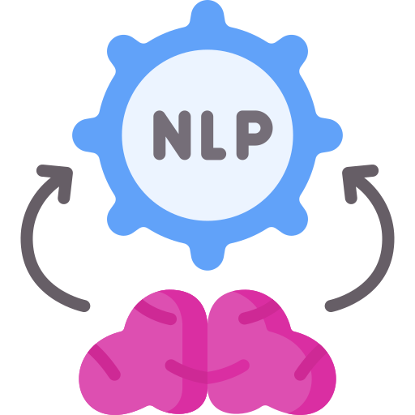

<h1>Nadav Idelsohn</h1>
<h2>Data Scientist | ML | Python</h2>
Highly motivated data scientist with hands-on experience in Python, SQL, and Machine Learning. Skilled in building ETL pipelines, creating real-time dashboards, and solving complex business problems using data-driven insights. Proficient in Deep Learning, NLP, and advanced data visualization. Seeking a junior data scientist role to leverage technical skills and contribute to innovative AI solutions.
<h4>Technical Skills: Python, Machine Learning, Data Analysis, SQL</h4>
<h1>Experience</h1> 

<b>Data analyst | Isreal Defence Forces (10/2022 - 09/2023)</b>

<ul>
  <li>Conducted data analysis on foot traffic during Ramadan, resulting in a 60% improvement in estimation accuracy and enabling data-driven decisions by leadership.</li>
  <li>Developed a BI system for real-time monitoring of camera statuses, ensuring 85% operational coverage.</li>
  <li>Automated manual processes using Python, reducing labor time by 90% while eliminating errors and enhancing user experience.</li>
  <li>Built and maintained data pipelines using Python and SQL for efficient data analysis.</li>
  <li>Designed and implemented ETL pipelines to support real-time decision-making, improving operational efficiency.</li>
</ul>

<h1>Projects</h1> 
<b>Career Break (11/2022 - Present)</b>

Holding DS/ML/DL skills through multiple domains projects creation, formal and self-studies. 

<table>
    <tr>
        <th>Children Internet Use</th>
        <th>Used Car Prices predictions</th>
    </tr>
    <tr>
        <td width="50%"> Analyzed children's physical activity and fitness data to identify early signs of problematic internet using <b>Machine Learning</b> models. Achieved a strong QWK score of 0.46.</td>
        <td width="50%"> Predicted the price of used cars using <b>Regression</b> and <b>Tuning</b> methods. Achieved a RMSE score of 72K.</td>
    </tr>
    <tr>
        <td></td>
        <td></td>
    </tr>
    <tr>
        <td><a href="https://github.com/Idelsohn/Children-Internet-Use" target="_blank"><button>View Project</button></a></td>
        <td><a href="https://github.com/Idelsohn/Used-Cars-Predictions" target="_blank"><button>View Project</button></a></td>
    </tr>
</table>
<table>
    <tr>
        <th>NLP tweets classification</th>
        <th>Obesity Risk Multi-Class</th>    
    </tr>
    <tr>
        <td width="50%">Classified disaster-related tweets with HuggingFace <b>transformers</b>, achieving 82% accuracy.</td>
        <td width="50%">Classified obesity risk in individuals, using <b>XGBoost</b>, <b>LGBM</b> and <b>autoML</b> models, achieving 91% accuracy.</td>
    </tr>
    <tr>
        <td></td>
        <td></td>
    </tr>
    <tr>
        <td><a href="https://github.com/Idelsohn/NLP_Tweets" target="_blank"><button>View Project</button></a></td>
        <td><a href="https://github.com/Idelsohn/Abalone_project" target="_blank"><button>View Project</button></a></td>
    </tr>
</table>

<b>Education</b>
<ul>
  <li>BSc in Computer Science (Data Science Track): The College of Management Academic Studies, expected 2025</li>
  <li>Machine Learning Specialization: Coursera, Andrew Ng (95 hours, completed 2022)</li>
  <li>Deep Learning Specialization: Coursera, Andrew Ng (125 hours, completed 2022)</li>
  <li>IDF Data Analyst Qualification: Comprehensive training in Python, PostgreSQL, and Power BI (completed 2022)</li>
</ul>
